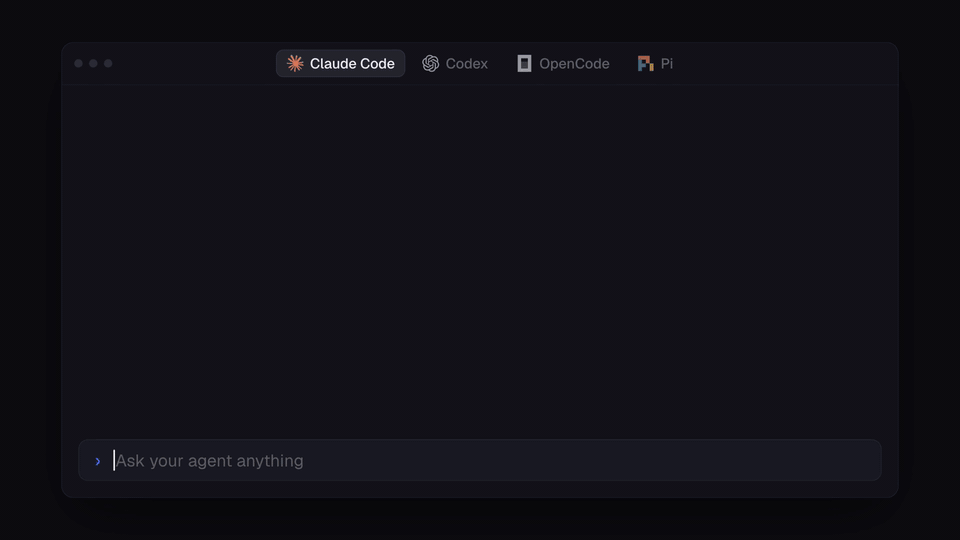
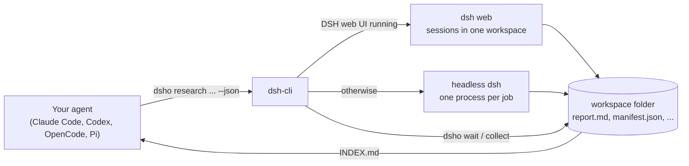

<div align="center">

# dsh-cli

**Let Claude Code, Codex, OpenCode, Pi or any other agent run DeepSeek Harness sessions in parallel.**

[](https://www.npmjs.com/package/dsh-cli)
[](https://github.com/nicremo/dsh-cli/actions/workflows/ci.yml)
[](LICENSE)


**[deepseekharnesscli.nicremo.de](https://deepseekharnesscli.nicremo.de)**



</div>

> **Unofficial community project.** dsh-cli is not affiliated with, endorsed by or sponsored by DeepSeek. "DeepSeek Harness" is a trademark of DeepSeek and is used here only to describe compatibility.

## Why

I use [DeepSeek Harness](https://github.com/deepseek-ai/deepseek-harness) (dsh) mostly for research and for many parallel sessions: ten research questions at once, collecting screenshots of articles, scroll videos of blog posts, stock footage. DeepSeek is fast and cheap, which makes it a great worker pool. What was missing is a way for my main coding agent to drive it: start the sessions, wait for them, read the results, follow up. That is what dsh-cli does.

dsh-cli is **agent first**. Every command is non-interactive, returns at once, prints compact text or `--json`, and uses stable exit codes. It ships an [Agent Skill](skills/dsh-orchestration/SKILL.md) that teaches Claude Code, Codex, OpenCode, Pi and other harnesses when and how to delegate work to DeepSeek Harness.

## Features

- **Parallel research batches**: `dsho research "q1" "q2" ...` runs one worker per question; each writes `report.md` and `sources.json`, `dsho collect` merges them into one `INDEX.md`.
- **Material gathering**: `dsho materials "brief"` runs one worker per kind (screenshots, scroll videos, news articles, stock footage, stock photos) with a `manifest.json` that records source and licence for every file.
- **Live in the DSH web UI**: when `dsh web` is running, every job is a real session in that UI. A batch becomes its own workspace, every session gets a readable title, and you can watch or step in.
- **Headless fallback**: without the UI, each job runs in its own headless dsh process with a lean profile (`orchestra`) that reuses your research MCP servers.
- **Steer like a human would**: `wait`, `status`, `logs -f`, `result`, `files`, `continue` (same session, same folder), `cancel`.
- **Deterministic captures**: `dsho capture shot|scroll <url>` takes clean screenshots and smooth 1080p scroll videos with Playwright (cookie banners dismissed, overlays hidden, ad networks blocked, watchdog for hanging pages).
- **No daemon**: state is plain JSON in `~/.dsho/`; detached runner processes keep jobs alive after the calling shell exits.

## How it works



1. Your agent calls `dsho` (usually through the bundled skill).
2. dsh-cli creates a workspace folder and one job per task, then hands each job to a detached runner and returns ids at once.
3. The runner either creates a session in the running DSH web UI (through its HTTP API) or starts `dsh --profile orchestra --json -` with the task on stdin.
4. Events are recorded in `~/.dsho/jobs/<id>/events.jsonl`, progress in `job.json`, the final answer in `result.md`.
5. Your agent waits with `dsho wait`, reads `dsho result` or `dsho collect`, and continues sessions with `dsho continue`.

## Requirements

- Node.js `>=22.19`
- [DeepSeek Harness](https://github.com/deepseek-ai/deepseek-harness), installed with `npm install -g @deepseek-ai/dsh` (or a source checkout), logged in once
- Optional, for `dsho capture`: Python 3 with Playwright (`pip install playwright && python3 -m playwright install chromium`) and ffmpeg
- macOS or Linux

## Install

```sh
npm install -g dsh-cli && dsho setup
```

`dsho setup` creates the headless dsh profile `orchestra` and installs the `dsh-orchestration` skill into `~/.agents/skills` (read by OpenCode and other harnesses) with links for Claude Code, Codex and Pi when they are installed. Run `dsho doctor` to check everything.

Only want the skill? `npx skills add nicremo/dsh-cli` works too, but the skill needs the CLI.

Two commands are installed: `dsh-cli` and the short alias `dsho`.

## Quick start

```sh
dsho ui start                       # optional: start the DSH web UI to watch jobs live
dsho research "AI agent pricing 2026" "State of MCP servers" "Prompt caching strategies" \
  --depth standard -C ~/dsh-workspaces/ai-2026
dsho wait last-batch --timeout 9m   # exit code 4: still running, wait again
dsho collect last-batch             # writes ~/dsh-workspaces/ai-2026/INDEX.md
```

```sh
dsho run -w "Summarize the release notes of Astro 6"           # one task, print the answer
dsho materials "Electric cars in Europe, neutral tone" --kinds screenshots,articles,stock-video
dsho continue last "Add three sources from 2026 and update report.md"
dsho capture scroll https://example.com/blog/post -o post.mp4 --duration 12
```

## Use it from your agent

After `dsho setup` your agents know the skill. Ask in plain language:

> Use DeepSeek Harness to research these 10 topics in parallel and give me a summary.

> Get me screenshots of recent news articles and some stock footage about solar power for my video.

The skill tells the agent to start a batch, wait in steps that fit its shell timeout, read `INDEX.md`, spot-check the results and follow up where needed. `dsho guide` prints the same manual for any agent without skill support.

## Commands

| Command | What it does |
|---|---|
| `dsho run <task>` | one job in the background (`-w` waits and prints the answer) |
| `dsho batch -f tasks.txt` | many jobs in parallel, one folder each (`.txt`, blocks split by `---`, `.json`, `.jsonl`) |
| `dsho research <q>...` | parallel research workers (`--depth quick\|standard\|deep`, `--focus`) |
| `dsho materials <brief>` | one worker per kind (`--kinds`, `--count`, `--url`) |
| `dsho status [ref]` | overview, or details of a job or batch |
| `dsho ls [--batches]` | list jobs or batches |
| `dsho wait <ref>...` | block until done (`--timeout`, `--any`) |
| `dsho result <ref>` | final answer(s) (`--files`) |
| `dsho logs <job>` | timeline of tool calls (`-f`, `--full`, `--raw`, `--stderr`) |
| `dsho files <ref>` | files the job created |
| `dsho continue <job> <text>` | continue the same session |
| `dsho cancel <ref>` | stop a job or a whole batch |
| `dsho collect <batch>` | write `INDEX.md`, merge `manifest.json` and `sources.json` |
| `dsho capture shot\|scroll <url>` | screenshots and scroll videos |
| `dsho ws init <dir>` | create a workspace with conventions in `AGENTS.md` |
| `dsho ui [start\|login]` | open, start or log in to the DSH web UI |
| `dsho skill install` | install or refresh the agent skill |
| `dsho setup` / `dsho doctor` | one-time setup / environment check |
| `dsho config [set\|unset]` | persistent settings |
| `dsho guide` | the manual for agents |

References: job id, batch id, unique prefix, name, `last`, `last-batch`. Common options: `-C <dir>` workspace folder, `-m flash|pro|v4-flash|vision`, `--effort off|low|high|max`, `-t <duration>` time limit, `-p <n>` parallelism, `-b auto|web|headless` backend. Every command has `--help`.

### JSON and exit codes

Every command accepts `--json` and prints one object: `{ "ok": true, ... }` or `{ "ok": false, "error", "code", "hint" }`.

| Exit code | Meaning |
|---|---|
| 0 | success |
| 1 | a job failed, timed out or was cancelled |
| 2 | usage error |
| 3 | job or batch not found |
| 4 | wait timeout reached, or the job is not finished yet |
| 5 | environment problem (dsh missing, UI unreachable, Playwright missing) |

## The DSH web UI backend

When the web UI is reachable, dsh-cli talks to its HTTP API (`POST /api/<namespace>/<method>`): it registers the workspace folder, creates a session in it, names it, optionally selects a model, sends the task, and polls the session log until the turn that answers the task has ended. The session log is translated into the same event format the headless mode produces, so `logs`, `status` and `result` work the same everywhere.

- `dsho ui start` starts `dsh web` in the background, captures the token URL it prints and logs in.
- If you start `dsh web` yourself, pass the URL it prints once: `dsho ui login "http://127.0.0.1:3080/?token=..."`. The resulting cookie is stored in `~/.dsho/web-auth.json` (mode 0600) and stays valid for 30 days, also across restarts.
- `-b web` makes a missing UI an error instead of falling back to headless.

## The headless backend and `dsho setup`

Headless jobs run `dsh --profile orchestra --json -` in the job folder. `dsho setup` builds that profile from the shipped headless template plus:

- MCP servers copied from another profile (default `web`): `--mcp research` (firecrawl, Brave, context7, Exa, Tavily, Perplexity, Jina and similar; default), `all`, `none` or a comma list of ids. Copied rows can contain API keys, so the profile file is written with mode 0600 and nothing is printed.
- A curated skill folder (`~/.dsh/skills-orchestra`, symlinks into `~/.agents/skills`) instead of your whole skill pool, which keeps the worker prompt about a third smaller. `--skills a,b,c` picks others, `--skills all` keeps dsh defaults.
- `.dsho-workspace` as an extra project root marker, so workers in batch subfolders still load the workspace `AGENTS.md`.

## Configuration

`dsho config set <key> <value>` stores settings in `~/.dsho/config.json`. Environment variables win over the file.

| Key | Environment | Meaning |
|---|---|---|
| `dshRepo` | `DSHO_DSH_REPO` | use a dsh source checkout (wins over `dshBin`) |
| `dshBin` | `DSHO_DSH_BIN` | path to the `dsh` executable (default: `dsh` on `PATH`) |
| `webUrl` | `DSHO_WEB_URL` | origin of the DSH web UI (default `http://127.0.0.1:3080`) |
| `backend` | `DSHO_BACKEND` | `auto`, `web` or `headless` |
| `workspaces` | `DSHO_WORKSPACES` | root for new workspaces (default `~/dsh-workspaces`) |
| `python` | `DSHO_PYTHON` | Python with Playwright for captures |

Other variables: `DSHO_HOME` (state folder, default `~/.dsho`), `DSH_HOME` (dsh home, default `~/.dsh`), `DSHO_WEB_TOKEN_URL` / `DSHO_WEB_TOKEN_FILE` (token URL of the web UI).

## Files

```
~/.dsho/
  config.json            settings
  web-auth.json          cookie for the DSH web UI (0600)
  jobs/<id>/             job.json, task.md, events.jsonl, stderr.log, result.md
  batches/<id>/          batch.json
  logs/                  runner logs
<workspace>/
  AGENTS.md, .dsho-workspace
  <nn-job>/              one folder per batch job
  INDEX.md               after dsho collect
```

## Troubleshooting

| Symptom | Fix |
|---|---|
| `dsh not found` | `npm install -g @deepseek-ai/dsh`, or `dsho config set dshBin <path>` |
| jobs do not show up in the UI | `dsho doctor`; `dsho ui start` or `dsho ui login <url>`; start jobs with `-b web` |
| a job is `lost` | its runner process died (reboot, kill); start it again |
| headless workers stall | set dsh's permission preset to full access for unattended runs (`dsho doctor` shows it) |
| `dsho capture` fails | `pip install playwright && python3 -m playwright install chromium`; scroll videos need ffmpeg |
| a page hangs during capture | the watchdog stops it after `--max-time` (default 90 s for shots) |

## Safety

dsh workers can run shell commands; many setups run dsh with full access and no sandbox. Keep tasks scoped to the workspace and never delegate deletes, deploys, git pushes or anything that touches secrets. Material found by workers is not automatically yours to publish: check licence and source in `manifest.json`. See [SECURITY.md](SECURITY.md) for reporting vulnerabilities.

## Development

```sh
git clone https://github.com/nicremo/dsh-cli && cd dsh-cli
npm install
npm test            # node:test with a fake dsh and a fake web UI; never touches your real setup
node bin/dsho.mjs help
```

Architecture notes: [docs/architecture.md](docs/architecture.md). Contributions are welcome, see [CONTRIBUTING.md](CONTRIBUTING.md).

## License

[MIT](LICENSE). The logos in the demo animation belong to their owners (Anthropic, OpenAI, OpenCode, Pi, DeepSeek) and only identify compatible tools.
